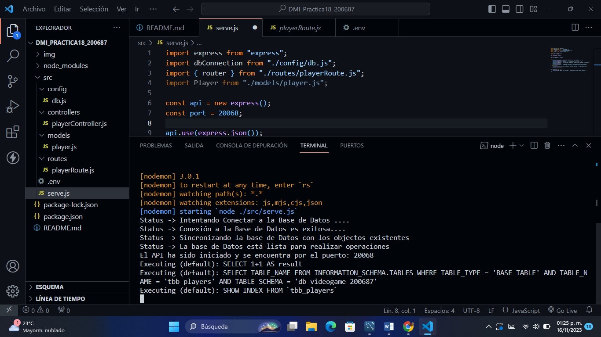
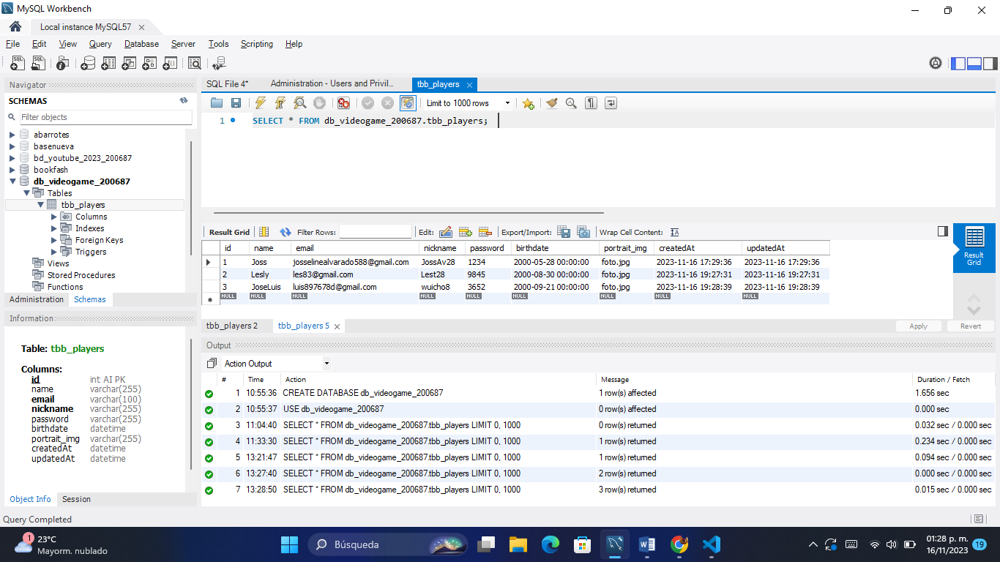
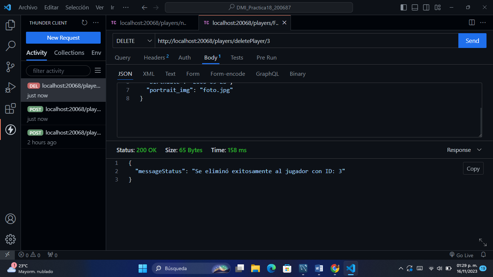
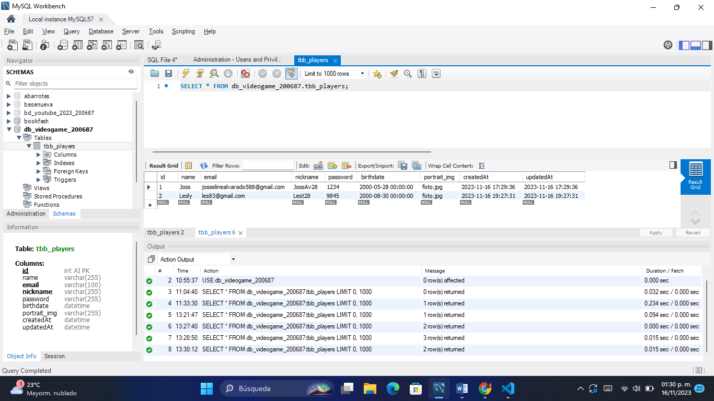

# DMI_Practica18_200687

# Universidad Tecnológica de Xicotepec de Juárez

## Ingeniería en Desarrollo y Gestión de Software
## Josseline Alvarado Vargas
## 10A
### Desarrollo Móvil Integral

## Descripcion

Esta aplicación de videojuego llamada Api Rest es un CRUD que se conectará a la aplicación integrada, pero ¿qué es CRUD? CRUD es la abreviatura de "Crear, Leer, Actualizar y Eliminar", que se utiliza para referirse a las funciones básicas en la base de datos o la capa de persistencia en el software, en pocas palabras, es la abreviatura de la forma de operar el almacenamiento. Información, el objetivo es poder mostrar el progreso o evolución de CRUD, cuya finalidad es poder conectarse a la API de TecnoGames Team. En este nuevo desarrollo se ha implementado una implementación de búsqueda en nuestro CRUD para poder buscar jugadores insertados en la base de datos, y también se ha incorporado la posibilidad de insertar datos de jugadores.

## Capturas de Pantalla de la Actividad

  
  
  
  